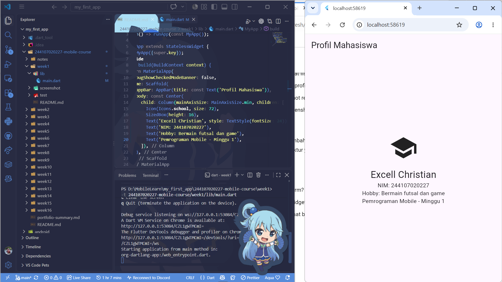
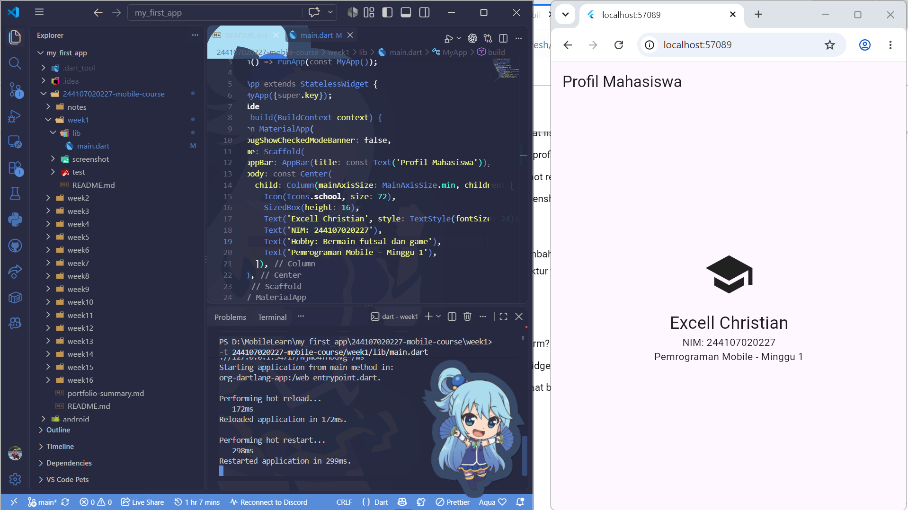

## Jawaban Refleksi

1. saat kita ingin development yang terfokus untuk 1 OS/device

2. kalau state berubah otomatis widget tree sebagai penyusun UI juga akan di update sehingga UI deklaratif bisa menyesuaikan outputnya

3. sangat bermanfaat karena tim akan mengerti terjadi perubahan apa pada kode, sehingga lebih mudah untuk berkolaborasi/maintain nya

## Penjelasan Task dan Kendala

### Hasil

1. disini saya menambahkan widget dasar yaitu text tentang NIM dan juga Hobby saya

### Kendala

1. disini saya menemukan kebingungan kenapa saat saya coba hot reload dan hot restart halaman tidak terupdate