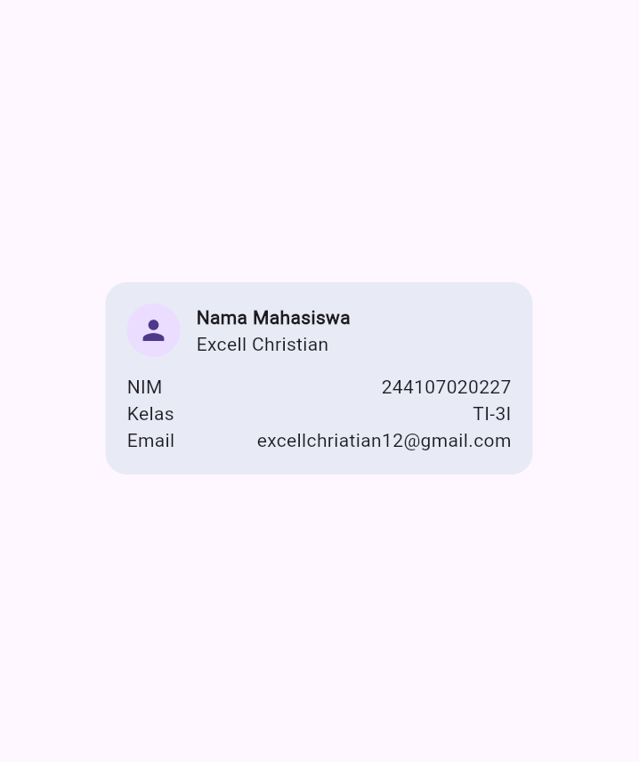
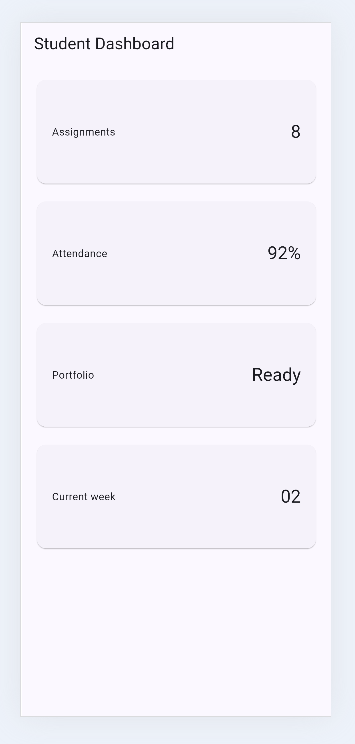
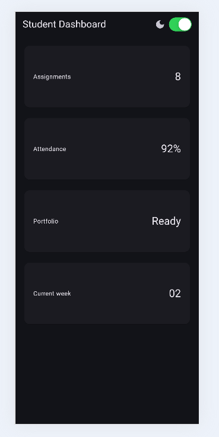
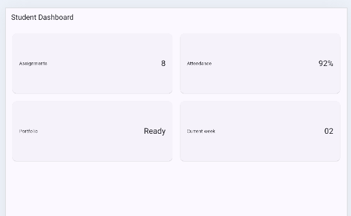
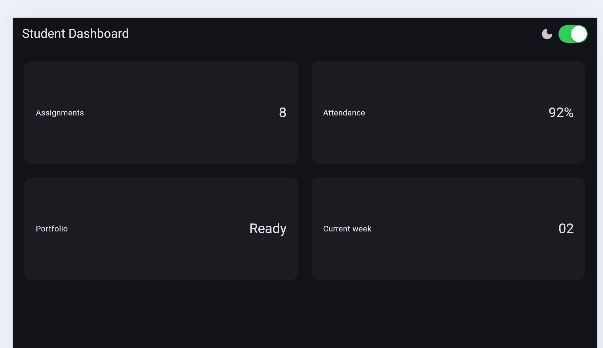
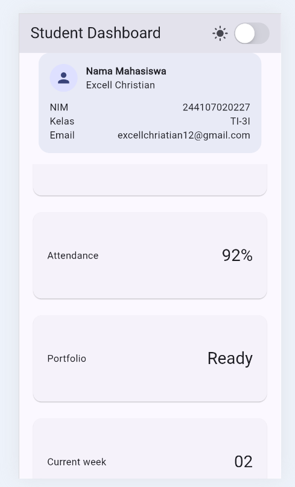
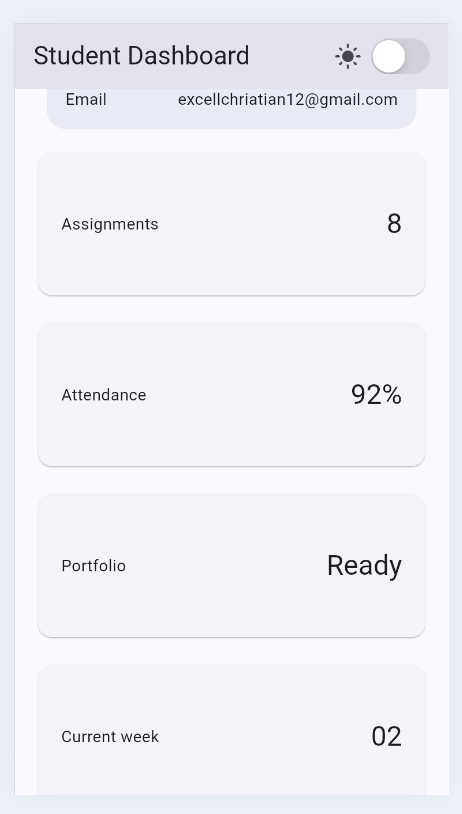

# Flutter Week 2 - Declarative UI & Responsive Design
This project is a Flutter application built for the Week 2 mobile development practical lab, focusing on declarative UI, responsive layout, theming, and basic accessibility.
## Checklist
- [x] Dashboard has a profile header and four information cards.
- [x] Layout uses `Row`, `Column`, `Expanded`, and `Container`.
- [x] One column on narrow screens, two columns on wide screens.
- [x] Light theme and dark theme are both readable, with a manual toggle (`CupertinoSwitch`).
- [x] Accessibility labels added for the theme toggle and each information card.
- [x] Screenshots of narrow and wide layouts saved in `screenshots/`.
- [x] Card widget refactored into a reusable `InfoCard`.
- [x] Hardcoded colors replaced with `Theme.of(context)`.
- [x] Breakpoint moved into a single named constant `kWideBreakpoint`.
- [x] `flutter analyze` run with no new errors/warnings.
- [x] `flutter test` passes both responsive widget tests.
## Project Description
This app extends the Week 2 starter dashboard into an **Academic Overview** page:
- A profile header (`ProfileCard`) showing student identity (name, NIM, class, email).
- Four reusable `InfoCard` widgets: Assignments, Attendance, Portfolio, Current week.
- `LayoutBuilder` switches the grid from 1 column (narrow screens) to 2 columns (wide screens, ≥ `kWideBreakpoint` = 700px).
- A `CupertinoSwitch` in the `AppBar` toggles between light and dark `ThemeData`, both seeded from `Colors.indigo`.
- `Semantics` labels are attached to the theme toggle and to every `InfoCard` so screen readers announce a meaningful description instead of raw numbers.
## Screenshots
### Profile card

### Narrow screen (mobile) - light & dark

### Wide screen (tablet) - light & dark

### Scroll experiment

## Setup Problem & Solution
- **Problem:** After adding `ProfileCard` above the `GridView` grid, the combined content (profile card + 4 info cards) overflowed the screen height on narrow devices - a plain `Column` inside `Scaffold.body` doesn't scroll on its own, so Flutter raised an overflow warning at the bottom of the screen (see `tidakpakaiscroll.png`).
- **Solution:** Wrapped the body content in a `SingleChildScrollView`, with `GridView.count` set to `shrinkWrap: true` and `physics: NeverScrollableScrollPhysics()`, so the whole page scrolls as one unit instead of the grid trying to scroll independently inside a `Column` (see `pakaiscroll.png`).
## AI Prompt Challenge
Independent implementation of the main task (Tugas Utama) was finished first. AI (Claude) was then used only to compare layout alternatives, per the jobsheet's AI policy.
### 1. Design prompt
**Prompt used:** "Bandingkan dua tata letak dashboard akademik untuk Flutter: versi `GridView` dan versi `LayoutBuilder` + `Column`. Jelaskan trade-off responsif dan aksesibilitasnya."
**Key output:**
- `GridView.count` (current approach): concise, automatically wraps cards into rows/columns, easy to keep a consistent `childAspectRatio`. Downside: the grid metaphor forces fairly uniform cell sizes, so cards with very different content lengths can get awkward empty space or clipped text unless `childAspectRatio` is tuned, screen readers traverse it in grid order, which works but is slightly less "linear" than a plain list.
- `LayoutBuilder` + `Column`/`Row` (manual approach): more code (you build the 1-column vs 2-column tree yourself), but gives full control over per-card sizing and a naturally linear reading order for screen readers.
- **Trade-off summary:** `GridView` wins on brevity and consistency for a fixed set of same-shaped cards (our case: 4 equal info cards), a manual `LayoutBuilder` + `Column` layout is better when cards vary a lot in size/content or when reading order must be tightly controlled.
### 2. Concept-reinforcement prompt
**Prompt used:** "Jelaskan kapan penggunaan `Expanded` justru menyebabkan overflow di dalam `Row`, beri contoh kode yang gagal dan perbaikannya."
**Key output:** `Expanded` itself doesn't cause overflow it *prevents* overflow by filling remaining space. Overflow happens when `Expanded` is used where its parent doesn't provide a bounded main-axis size, e.g. inside a horizontally-scrolling `ListView`, which is unbounded along its scroll axis.
### 3. Verification prompt
**Prompt used:** "Periksa kembali rekomendasi layout di atas: apakah tetap responsif di bawah 600px, apakah mengurangi aksesibilitas, dan apakah ada widget yang tidak tersedia di Flutter stabil saat ini?"
**Self-audit result:**
- **Below 600px:** `GridView.count` at `crossAxisCount: 1` collapses to a single column, so it stays readable down to narrow widths (verified conceptually at 400px in the widget test). No fixed pixel widths are used that would break at small sizes.
- **Accessibility:** Wrapping each `InfoCard` in `Semantics(label: '$title: $value')` makes a screen reader announce "Assignments: 8" as one phrase instead of two disconnected text nodes this improves, not reduces, accessibility.
- **Widget availability:** `GridView.count`, `LayoutBuilder`, `CupertinoSwitch`, `Semantics`, and `Theme.of(context)` are all part of current stable Flutter (Material 3 + Cupertino) nothing experimental or deprecated.

**Decision taken:** Kept `GridView.count` rather than switching to the manual `LayoutBuilder` + `Column` alternative, since the dashboard only has 4 uniform cards the comparison showed `GridView` is the better fit here, and the verification step confirmed it doesn't regress responsiveness or accessibility. This is a decision I can explain and defend at code review, not just AI output copied as-is.

## Reflection
- **Apa perbedaan cara berpikir imperative dan declarative saat membangun UI?**
  Imperative programming describes *how* to change the UI step by step (find a widget, mutate its property, refresh it manually). Declarative programming (Flutter's model) describes *what* the UI should look like for a given state, when the state changes, Flutter diffs the widget tree and rebuilds only what's needed the developer never manually touches individual UI elements.
- **Kapan `Expanded` membantu dan kapan penggunaannya justru menghasilkan layout error?**
  `Expanded` helps whenever a child should fill remaining space inside a `Row`/`Column` with a bounded main-axis size like the label/value pair in `InfoCard`. It causes a `RenderFlex` overflow error when placed inside a parent with unbounded size along that axis, because "fill remaining space" is undefined when the available space is infinite.
- **Bagaimana breakpoint dan theme memengaruhi pengalaman pengguna?**
  `kWideBreakpoint` decides when the layout switches from 1 to 2 columns, so content stays comfortably readable instead of being squeezed on small screens or leaving large empty gaps on wide ones. Theme (light/dark, color scheme) affects contrast and readability using `Theme.of(context)` instead of hardcoded colors keeps the UI legible and consistent regardless of which mode the user picks.
- **Apa yang Anda verifikasi dari rekomendasi AI setelah tugas inti selesai?**
  That the recommended `GridView` approach still collapses to one column below 600px, that adding `Semantics` labels actually improves (not reduces) screen-reader output, and that every widget referenced (`GridView.count`, `LayoutBuilder`, `CupertinoSwitch`, `Semantics`) is part of current stable Flutter with no deprecated or unstable APIs involved.