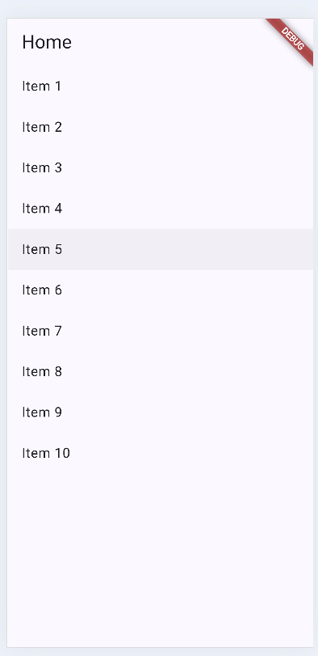
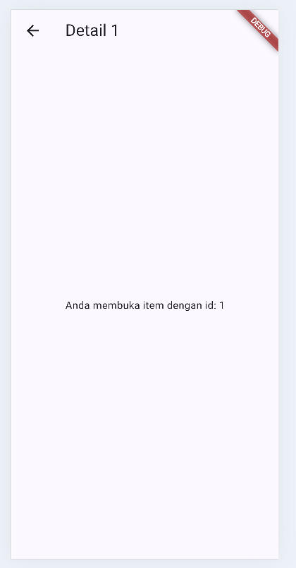
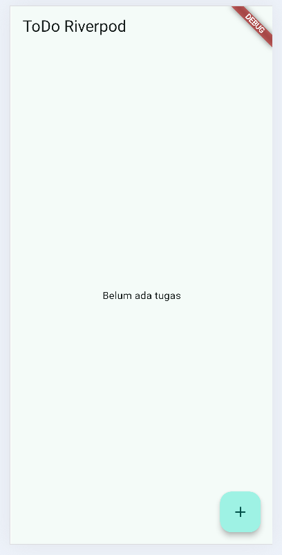
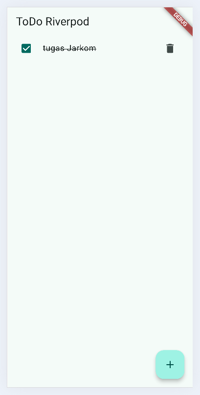
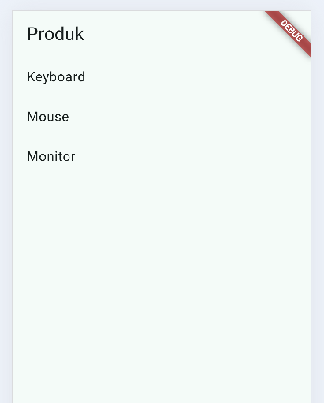
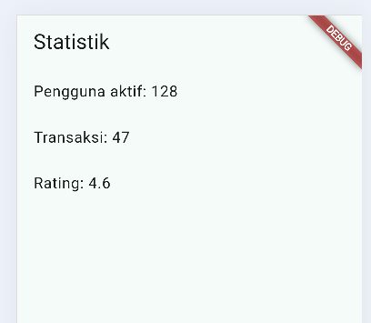
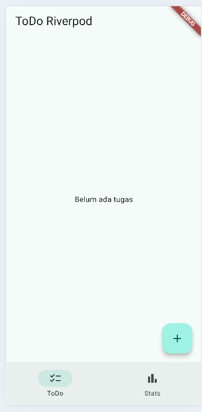

## Project Description
This app combining **ToDo + Stats** pages:
- The Home and Detail pages (Praktikum 1) show how to move between screens using GoRouter so it's not just one static screen, users can open a detail view from an item in the list.
- The ToDo page (Praktikum 2) is a task list where you can add, check off, and delete tasks.
- The part that shows a single task (checkbox + title + delete button) was pulled out into its own widget called TodoTile, so the ToDo page's code stays short and is easier to test (Refactor Challenge #1).
- A feature to filter out only the unfinished tasks was also added, through incompleteTodosProvider so if needed later, the app can show just what's left to do without writing new logic (Refactor Challenge #2).
- The Stats page (built from the AI Prompt Challenge, then manually double-checked) simulates fetching data from a server that sometimes fails 30% chance. The UI already handles all three situations: loading, failed (with a retry button), or successfully showing the data.
- Switching between the ToDo and Stats pages uses a NavigationBar at the bottom of the screen, so users just tap an icon instead of needing a back button (Refactor Challenge #3).

## Screenshots
### Praktikum 1



### Praktikum 2



### Praktikum 3


### AI Prompt Challenge


### Refactor Challenge


## AI Prompt Challenge

**Prompt used:**
```
Buatkan halaman Flutter bernama StatsPage menggunakan flutter_riverpod.
Requirements:
- ConsumerWidget dengan satu AsyncNotifierProvider yang mensimulasikan
  pengambilan data statistik (delay 2 detik, kadang gagal 30%).
- UI harus menangani loading (spinner), error (pesan + tombol retry),
  dan success (ListView 3 item).
- Berikan unit test untuk notifier-nya.
Jelaskan setiap bagian kode dalam komentar.
```
## AI Verification Checklist
- State immutable? **Ya** `AsyncValue.guard` selalu bikin instance baru, tidak mutasi langsung.
- `ref.watch` di `build`, `ref.read` di callback? **Ya** `watch` di `build()`, `read` di `onPressed` tombol retry.
- Ketiga state tertangani? **Ya** `.when(loading, error, data)` aman.
- Provider eksplisit & tidak duplikat? **Ya** satu `AsyncNotifierProvider<StatsNotifier, List<String>>`.
- Pakai API lama? **Tidak** sudah `AsyncNotifier`/`ConsumerWidget`.
- `flutter analyze`/`test`? **Awalnya tidak clean** - warning `unnecessary_type_check` di test karena `if (result is AsyncData<...>)` yang sudah pasti `true`.

**Decision taken:** Unit test-nya diperbaiki, buang type-check yang tidak perlu

## Reflection
- **Kapan `setState` masih cukup, dan kapan state harus naik ke Riverpod?**
  setState is fine when only ONE page needs that data and nobody else cares about it. But our Todo list needs to be seen and changed from many places (checkbox and delete button). So we move it up to Riverpod (TodoListNotifier), now the data lives outside the pages and stays safe no matter which
- **Apa perbedaan `context.go` dan `context.push`, dan kapan masing-masing tepat digunakan?**
  context.go() = "teleport" to a new page, replacing everything before it, good for switching tabs (like our Home and Stats navbar), because we don't want to go "back" to the old tab. context.push() = "stack" a new page on top, keeping the old one underneath, good for opening a Detail page, because the user expects the back button to return to the list.