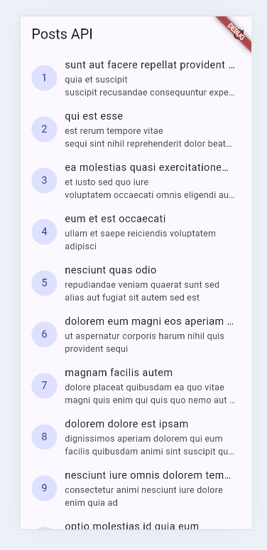
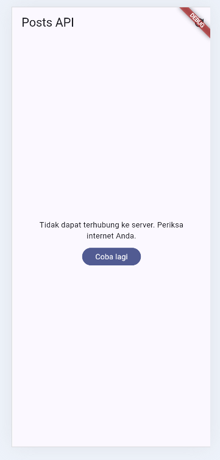
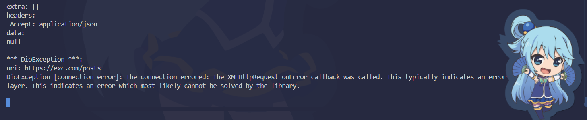
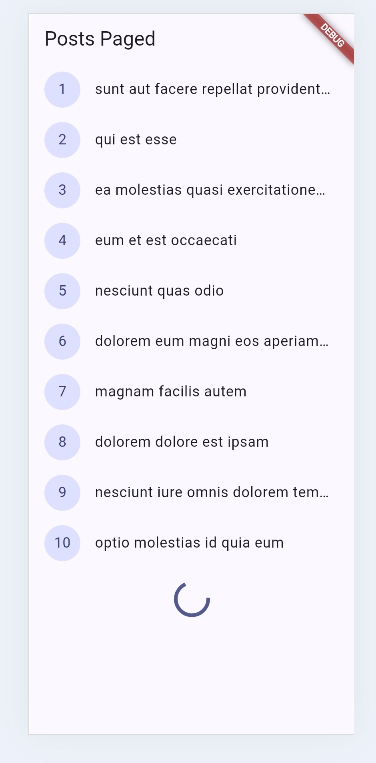
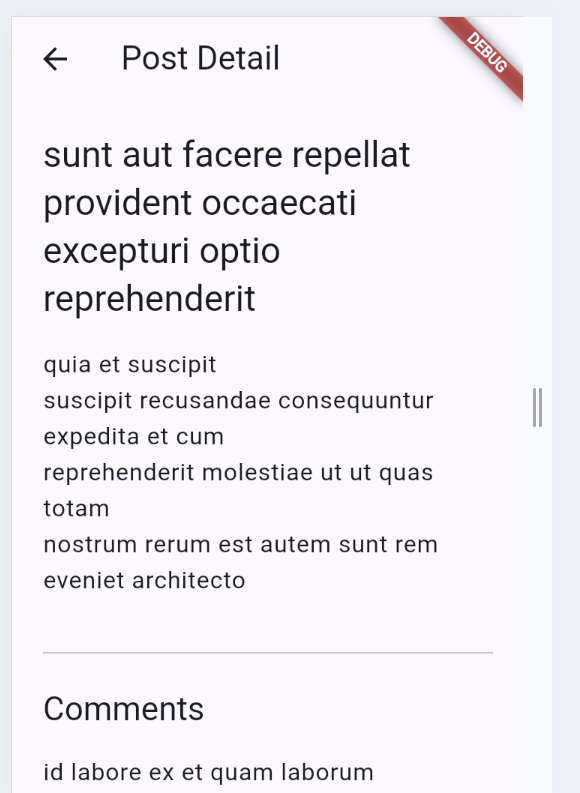

## Project Description

This app is a **Posts API** application built with Flutter using **Dio + Riverpod**:

- The app fetches posts from JSONPlaceholder through a Repository layer, so the UI does not call Dio directly.
- Dio configuration such as `baseUrl`, timeout, headers, and logging interceptor is centralized in `api_client.dart`.
- The UI handles **loading, error, empty, and success** states, including a retry button and pull-to-refresh.
- Pagination with **10 items per page** and infinite scroll was implemented using `_page` and `_limit`, with a guard to prevent duplicate requests.
- The `PostTile` widget was extracted from `ListView.builder` to make the UI shorter and reusable (Refactor Challenge #1).
- `friendlyErrorMessage` was moved to `network_errors.dart` so it can be reused by multiple pages (Refactor Challenge #2).
- A post detail page was added using **GoRouter `/post/:id`**, using the existing post data or fetching it again through the repository when needed (Refactor Challenge #3).
- Comments are fetched through `CommentRepository` and `commentsProvider` using `/comments?postId={id}`.

## Screenshots

### REST API



### Error Handling



### Change Base URL



### Pagination



### Detail Page + Comment



## AI Prompt Challenge

**Prompt used:**

```text
Buatkan repository layer Flutter untuk endpoint GET /comments?postId={id}
dari JSONPlaceholder menggunakan Dio + flutter_riverpod.
Requirements:
- Model Comment dengan fromJson aman null (postId, id, name, email, body).
- CommentRepository dengan method fetchComments(postId) + timeout 10 detik.
- AsyncNotifierProvider dengan penanganan error otomatis (AsyncError)
  dan fungsi pesan error
  ramah pengguna untuk timeout, connection error, 404, dan 500.
- Satu unit test untuk fromJson dengan field yang hilang.
Jelaskan setiap bagian kode dalam komentar.
```

## AI Verification Checklist

- Apakah UI memanggil Dio secara langsung? **Tidak**, UI menggunakan repo.
- Apakah `fromJson` aman null? **Ya**, field yang missing menggunakan fallback.
- Apakah semua tipe `DioExceptionType` yang diperlukan dipetakan? **Ya**, timeout, connection error, dan bad response dihandle melalui `friendlyErrorMessage`.
- Apakah `baseUrl` dan timeout terpusat? **Ya**, konfigurasi nya ada di `api_client.dart`.
- Apakah test hanya menguji happy path? **Tidak**, ada edge case field yang hilang pada `Post.fromJson`.

## Reflection

- **Mengapa UI dilarang memanggil Dio langsung?**

  agar UI cukup berinteraksi dengan Riverpod, sedangkan repo menangani API sehingga kode lebih mudah dipelihara dan diuji.

- **Kapan pagination client-side cukup, dan kapan harus mengandalkan pagination server?**

  Pagination client-side dipakai untuk data yang kecil dan sudah tersedia di aplikasi. Untuk data yang besar, seharusnya menggunakan pagination server karena aplikasi hanya mengambil data yang dibutuhkan.