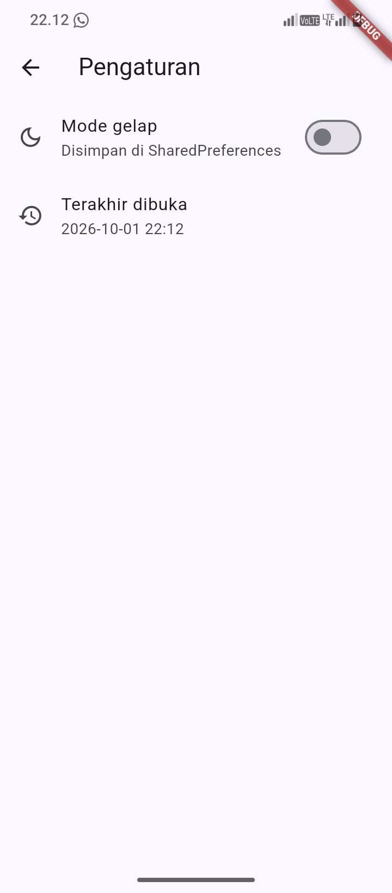
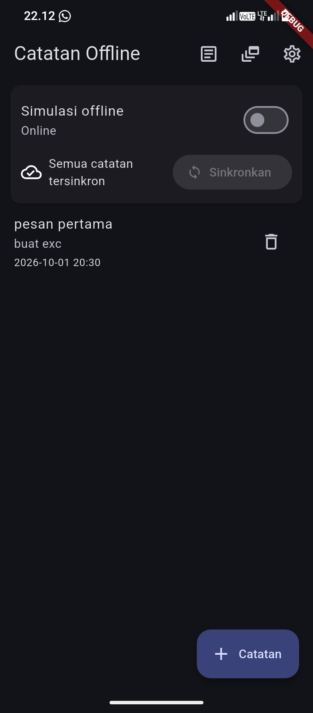
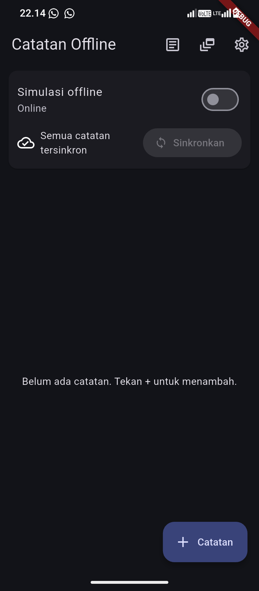
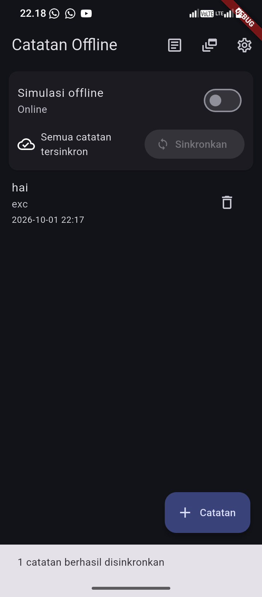
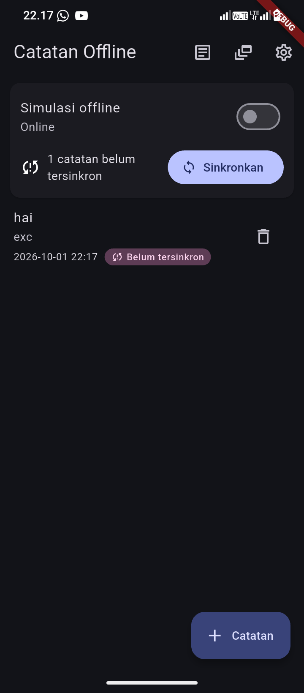
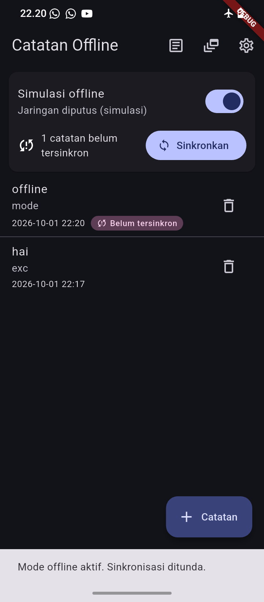
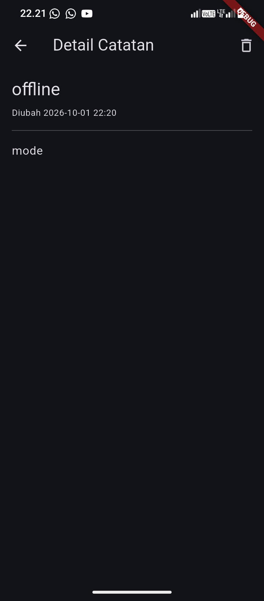

## Project Description
 
This app is an **Offline Notes** application built with Flutter using **SharedPreferences + SQLite (sqflite) + Riverpod**:
 
- User preferences (dark mode and last opened time) are stored in **SharedPreferences** through `PrefsRepository`, so the UI never calls the plugin directly.
- Notes are stored in a local **SQLite** database (`offline_notes.db`) through `NoteRepository`, with a `notes` table (`id`, `title`, `body`, `updated_at`, `dirty`) and a `cached_posts` table.
- The notes page works fully offline (read, add, delete) and handles **loading, error, empty, and success** states with `AsyncValue`.
- Every new note is saved with `dirty = 1`. A badge shows how many notes are not yet synchronized, and each unsynchronized note shows a "Belum tersinkron" badge.
- `syncNotes` in `lib/data/sync.dart` simulates an upload (1 second delay) and only marks the notes from the initial snapshot as clean, so notes added during a sync are not marked as synced by mistake.
- **Cache-first read** for `GET /posts`: the local cache is shown immediately, then refreshed from the network in the background and saved again. When the cache is empty, the app waits for the network once.
- A deterministic **offline simulation toggle** (`forceOfflineProvider`) is available for demo and testing: sync is rejected while offline and the posts page only shows the cache.
- Conflict rule: **last-write-wins based on `updated_at`**. Currently the flow is one-way (local to simulated remote), so the local version always wins.
- The `NoteTile` widget was extracted from `ListView` (Refactor Challenge #1).
- Cache posts and `syncNotes` logic were moved to `lib/data/sync.dart` so the repository stays focused on CRUD (Refactor Challenge #2).
- A note detail page was added using **GoRouter `/note/:id`**, reading from the local repository instead of the list state (Refactor Challenge #3).

## Screenshots
 
### Preferensi: Mode Terang
 

 
<br><br><br><br>
 
### Preferensi: Mode Gelap
 

 
<br><br><br><br>
 
### Preferensi Bertahan Setelah Aplikasi Dibuka Ulang
 

 

 
<br><br><br><br>
 
### Terakhir Dibuka
 

 
<br><br><br><br>
 
### Daftar Catatan Kosong (Empty State)
 

 
<br><br><br><br>
 
### Tambah Catatan
 

 
<br><br><br><br>
 
### Daftar Catatan + Badge Belum Tersinkron
 

 
<br><br><br><br>
 
### Sinkronisasi Ditolak Saat Mode Offline
 

 
<br><br><br><br>
 
### Detail Catatan
 

 
<br><br><br><br>
 
## AI Prompt Challenge
 
**Prompt used:**
 
```text
Aplikasi Flutter Offline Notes: CRUD catatan + preferensi tema.
Bandingkan SharedPreferences, Hive, sqflite (SQLite), dan Drift
untuk dua kebutuhan ini. Requirements:
- Kriteria: kompleksitas query, kebutuhan relasi, reaktivitas (stream),
  type-safety, ukuran boilerplate, dan kemudahan testing.
- Beri rekomendasi final: mana untuk preferensi, mana untuk catatan,
  beserta alasannya dalam 1 tabel.
- Tunjukkan skema tabel/kotak untuk 1000+ catatan.
Jelaskan trade-off setiap pilihan.
```
 
## AI Verification Checklist
 
- Apakah AI menempatkan daftar catatan di SharedPreferences? **Tidak**, daftar catatan diarahkan ke SQLite.
- Apakah skema AI mendukung antrean sync (dirty flag / updated_at)? **Ya**, tabel `notes` punya kolom `dirty` dan `updated_at`
- Apakah klaim "real-time" AI didukung stream? **Sebagian**, stream hanya ada di Drift dan Hive. Pada sqflite UI di-refresh manual dengan `ref.invalidateSelf()`.
- Apakah estimasi boilerplate AI masuk akal setelah dicoba? **Ya**, SharedPreferences paling kecil (hanya `flutter pub add`), sedangkan Drift paling besar karena butuh `build_runner`