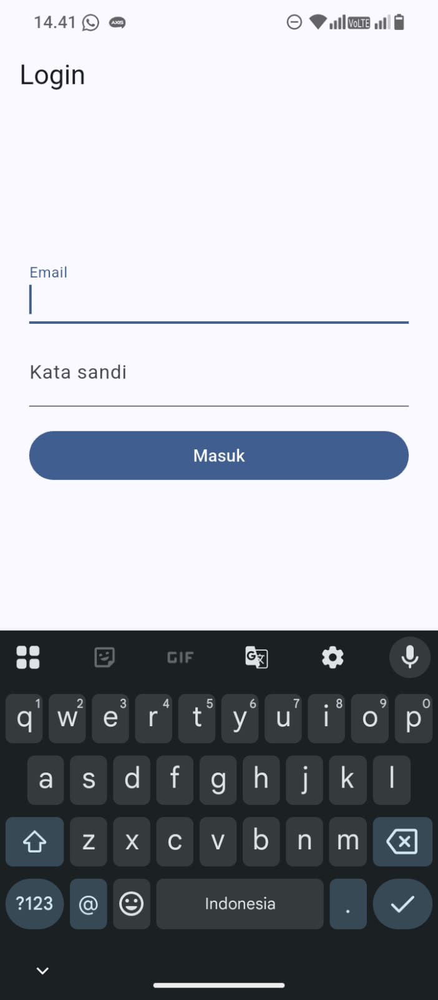
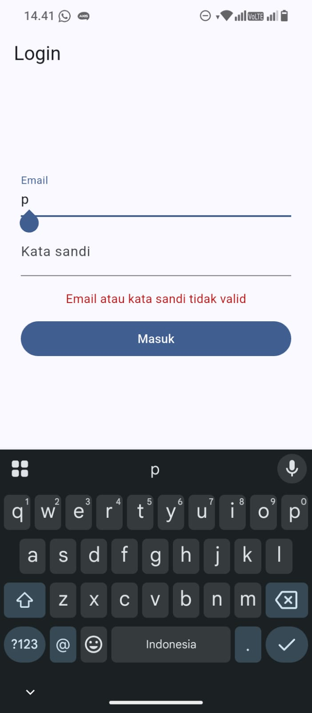
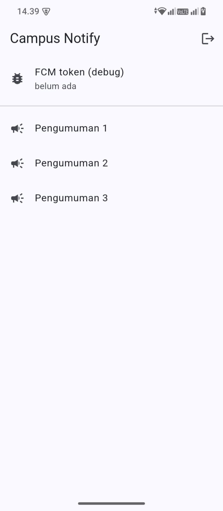
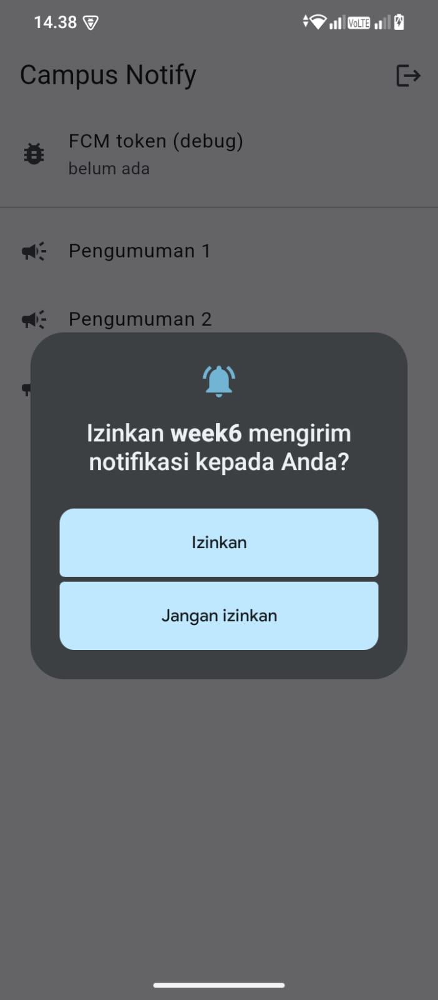
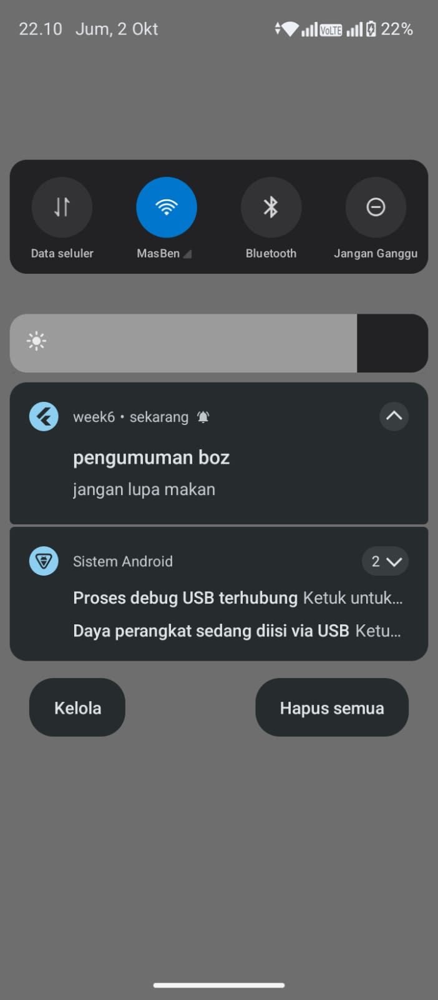
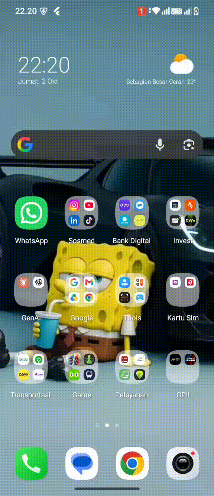
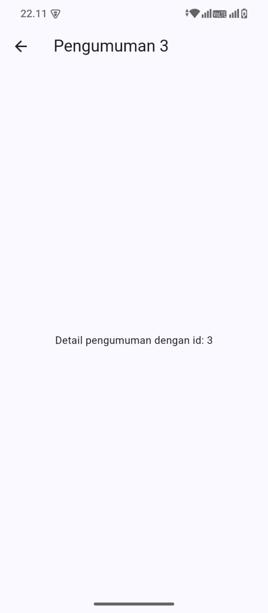

## Project Description

This app is a **Campus Notification App** built with Flutter using **Riverpod + GoRouter + Dio + flutter_secure_storage + Firebase Cloud Messaging (FCM)**:

- **Mock authentication with simulated JWT** through `AuthRepository` (`login` and `refresh`). The point where Firebase Auth would be plugged in is marked in the code, so migrating only means swapping the token source.
- **Secure token storage** in `TokenStore` (`lib/data/token_store.dart`) backed by `flutter_secure_storage` (Android Keystore). The access token and refresh token are **never** stored in SharedPreferences, hardcoded, or fully printed to logs.
- **Dio with automatic token refresh** (`lib/data/api_client.dart`): on a `401`, the interceptor exchanges the refresh token, updates the access token, and retries the request **once**. If the refresh fails, the tokens are cleared (`clear()`) and the user is sent back to `/login`.
- **Auth state** is managed by `AuthNotifier` (`AsyncNotifier<bool>`) in `lib/providers/auth_provider.dart`, and the **GoRouter `redirect`** guards routes: unauthenticated users are always redirected to `/login`, and logged-in users cannot open `/login`.
- **FCM** in `lib/messaging/push_service.dart`:
  - `requestNotificationPermission` (runtime permission for Android 13+).
  - `getToken` + `onTokenRefresh` for the token lifecycle (the token is sent to the `POST /devices` endpoint).
  - `subscribeToTopic('pengumuman-kampus')` for broadcast messages.
  - `FirebaseMessaging.onMessage` + `flutter_local_notifications` so a banner still appears in **foreground**.
  - `onMessageOpenedApp` for taps in **background**, and `getInitialMessage` for taps in **terminated** state.
  - The background handler is a **top-level** function annotated with `@pragma('vm:entry-point')`.
- Messages always use a **combined `notification` + `data` payload**: `notification` for human-readable text, and `data.route` (e.g. `/pengumuman/3`) for the deep link to `AnnouncementPage`.

## Screenshots

### Practicum 1: Login Page



<br><br><br><br>

### Practicum 1: Failed Login



<br><br><br><br>

### Practicum 1: Home After Successful Login (Route Guard)



<br><br><br><br>

### Practicum 2: Notification Permission (Android 13+)



<br><br><br><br>

### Practicum 3: Notification in Foreground


<br><br><br><br>

### Practicum 3: Notification in Background



<br><br><br><br>

### Practicum 3: Notification in Terminated State



<br><br><br><br>

### Deep Link Destination Page `/pengumuman/3`



<br><br><br><br>

| State      | Expected result                                           | Handler that works                                | Result  |
| ---------- | --------------------------------------------------------- | ------------------------------------------------- | ------- |
| Foreground | Local banner appears, tap opens `/pengumuman/3`           | `onMessage` + `flutter_local_notifications`       | Passed  |
| Background | System banner appears, tap opens the correct route        | Automatic system banner + `onMessageOpenedApp`    | Passed  |
| Terminated | App opens to the correct route after tapping the banner   | `getInitialMessage` (+ `pendingDeepLink`)         | Passed  |

Testing was done on a physical Android device.

## AI Prompt Challenge

**Prompt used:**

```text
Aplikasi Flutter Campus Notification App.
Stack: firebase_messaging, flutter_local_notifications,
flutter_secure_storage, go_router, Riverpod.
Buatkan PushService dengan:
- requestPermission + getToken + onTokenRefresh (kirim ke POST /devices)
- onMessage (tampilkan local notification manual)
- onMessageOpenedApp + getInitialMessage (navigasi ke data.route)
- subscribe/unsubscribe topic pengumuman-kampus
- background handler top-level dengan @pragma('vm:entry-point')
Tandai bagian yang BERBEDA untuk Android 13+ vs iOS,
dan bagian yang tidak boleh mengakses BuildContext.
```